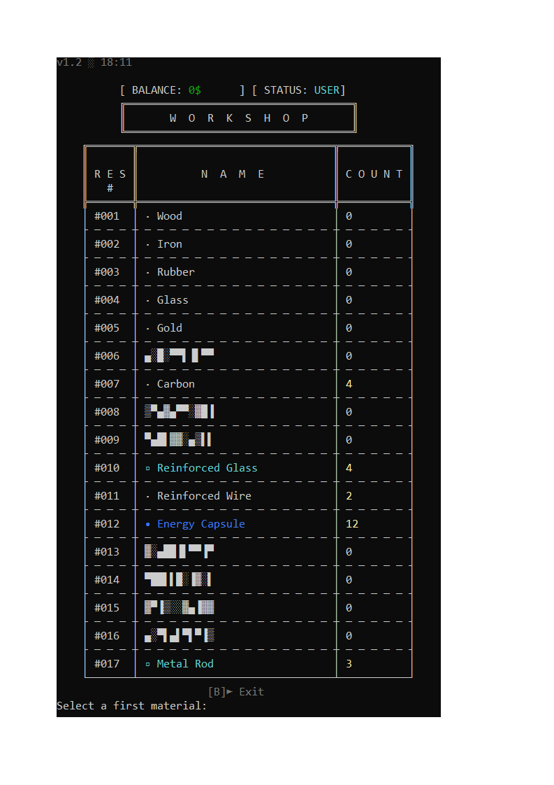

# 🚀 Batch Wood Legacy v1.2

#### Hi everyone! I'm 13 years old, and I decided to build my first own full-scale game 
#### using nothing but pure Windows Batch (CMD). 
<br>
<br>
<details>
<summary>🧭 Navigation... <sub>(expand)</sub></summary>
<br>
  
* [](#how-it-all-started-dev-story)
* [-About the Game-](#about-the-game)

</details>

## How It All Started (Dev Story)

It all started when I was playing Roblox using a third-party utility to bypass network blocks. Everything was fine until one day it completely broke down. I spent 3 days straight trying to fix it, accidentally wiped out my DNS server a couple of times, but nothing worked.

That's when I looked at the file extension of that utility and saw the magical `.bat`. I opened it, understood absolutely nothing at first, and started googling what it even was. A few days later, I made a bold decision: *"I want to build a game using this!"*

Originally, it was never meant to be this massive. But over time, features kept piling up, and the project just kept expanding. In the end, after exactly 52 days of hard work (spending 7 to 10 hours a day coding!), I arrived at this final playable result.

Let's dive into all the engine features below!

---
<br>

## About the Game

This game is all about resource management and crafting various items (there are about 30+ unique craftable recipes in total) to earn money by selling them on the market.

At the end of the game, your ultimate goal is to figure out the secret rocket craft recipe. To do that, you'll have to interact and negotiate with Gabe himself!

But if you want to uncover all the dark secrets of this universe... you'll have to play it and find out for yourself!

---
<br>



## 🎮 Game Features & Content

•  **Full Save & Load System** - Easily save your progress into dedicated slots and reload whenever you want.

•  **Progressive Workshop Levels** - Upgrade your workshop through 4+ distinct tiers to unlock advanced content.

•  **30+ Unique Crafting Recipes** - Discover, gather resources, and craft dozens of multi-level items.

•  **Dynamic Economy & Trading** - Buy materials, track price shifts, and dominate the market.

•  **Secret Endgame Goals** - Uncover hidden blueprints, build the final rocket, and crack all the mysteries.

<br clear="right"/>

---
<br>

## Scripting Hacks & Mechanics
<br>

### 1. Character-by-Character Renderer
This code creates a smooth typewriter effect to render text character-by-character.

<details>
<summary> Code <sub>(expand)</sub></summary>
<br>

```batch
:Render_Msg

set "char="
set "BeginMsg="

for /f "delims=()/ tokens=2,3" %%a in ("%~1") do (
    set "msg=%%a"
    set "MsgPad=%%b"
)

if not "!MsgPad!"=="0" (
    for /l %%q in (1, 1, !MsgPad!) do (
        <nul set /p "=!ESC![1C"
    )
)

for /f "delims=()/ tokens=2,3" %%a in ("%~3") do (
    set "BeginMsg=%%a"
    
    if defined BeginMsg (
        for /l %%q in (0, 1, 99) do (
            set "char=!BeginMsg:~%%q,1!"
            <nul set /p "=!char!"
        )
        for /l %%q in (0, 1, %%b) do (
            <nul set /p "=!ESC![1C"
        )
    )
)

for /l %%q in (0, 1, 99) do (

    set "flag_1=0"
    set "ping=1000"
    set "char=!msg:~%%q,1!"
    
    if "!char!"==" " (
        if "%~2"=="SpaceDelay-true" set "ping=10000"
        set "flag_1=1"
    )

    if "!char!"=="" (
        exit /b
    ) else (
        if "!flag_1!"=="1" (
            <nul set /p "=!ESC![1C"    
        ) else (
            <nul set /p "=!char!"
        )
    )
    for /l %%j in (1, 1, !ping!) do set "idln=1"
)
```
Usage:
```batch
call :Render_Msg "Msg(Hello World/4)" "SpaceDelay-true" "BeginMsg(Nobody:/1)"
```
</details>

Let's break down its syntax:

• `"Msg(TEXT/PADDING)"` - The main message and its left padding size.

• `"SpaceDelay-true/false"` - Toggles extra delay when a space character is processed.

• `"BeginMsg(Nobody:/1)/()"` - The speaker name tag (e.g., `%c7%Nobody%c0%:`) and its trailing padding.
<br>

Important Note: Do not use the / symbol in any text (whether it's the main message or the speaker tag),
otherwise the syntax parser will break.

---
<br>

### 2. Dynamic Loading Bar with Live Tips

This script renders a smooth progress bar that fills up dynamically.
While loading, it tracks the system time in seconds and rotates game tips every 3 seconds.

<details>
<summary> Code <sub>(expand)</sub></summary>
<br>

```batch
:Engine_Anim_Progress_Bar

set "bar1=│ "
set "bar2=░░░░░░░░░░░░░░░░░░░░"
set "stageloadanim=0"
set "curr_tick=0"
set "last_tick=0"
set "accumulator_time=0"
set /a "tip_id=(%RANDOM% %% 6) + 1" 

::Times
set "hh=!time:~0,2!"
set "mm=!time:~3,2!"
set "ss=!time:~6,2!"
set "hh=!hh: =0!"

set /a "last_tick=(1!hh! - 100) * 3600 + (1!mm! - 100) * 60 + (1!ss! - 100)"


set "curr_tip=TIP!tip_id!"
for /f "delims=" %%r in ("!curr_tip!") do (
    set "curr_tip=!%%r!"
)

cls
for /l %%q in (0, 1, 2) do (
    for %%v in (. .. ...) do (

        set "flag1=%%v"
        
        set "bar2=!bar2:~0,-2!"
        for /f "delims=" %%a in ("!bar1!") do set "bar1=!bar1!▓▓" 
        
        set "final_bar=!bar1!!bar2!"
        
        set /a "stageloadanim+=10"
        set "stageloadanim=!stageloadanim!!space!"
        set "stageloadanim=!stageloadanim:~0,3!"

        echo.
        echo                                 %~1!flag1!
        echo                               ┌───────────────────────────┐
        echo                               !final_bar! !stageloadanim!%% │
        echo                               └───────────────────────────┘
        echo     !curr_tip!
        
        ping -n 1 -w %~3 127.255.255.255 >nul
        
        ::Times
        set "hh=!time:~0,2!"
        set "mm=!time:~3,2!"
        set "ss=!time:~6,2!"
        set "hh=!hh: =0!"

        
        set /a "curr_tick=(1!hh! - 100) * 3600 + (1!mm! - 100) * 60 + (1!ss! - 100)"
        
        set /a "passed_time=curr_tick - last_tick"

        if !passed_time! LSS 0 set /a "passed_time+=86400"
        
        set /a "accumulator_time+=passed_time"
        
        if !accumulator_time! GEQ 3 (
            set /a "tip_id=(!RANDOM! %% 6) + 1"
            set "curr_tip=TIP!tip_id!"

            for /f "delims=" %%r in ("!curr_tip!") do (
                set "curr_tip=!%%r!"
            )
            set "accumulator_time=0"
        )
        set "last_tick=!curr_tick!"
        cls
    )
)
set "final_bar=│ ▓▓▓▓▓▓▓▓▓▓▓▓▓▓▓▓▓▓▓▓"
echo.
echo                                   %c2%%~2%c0%    
echo                               ┌───────────────────────────┐
echo                               !final_bar! 100%% │
echo                               └───────────────────────────┘


ping -n 1 -w %~4 127.255.255.255 >nul

cls
exit /b
```
Usage:
```batch
call :Engine_Anim_Progress_Bar "


